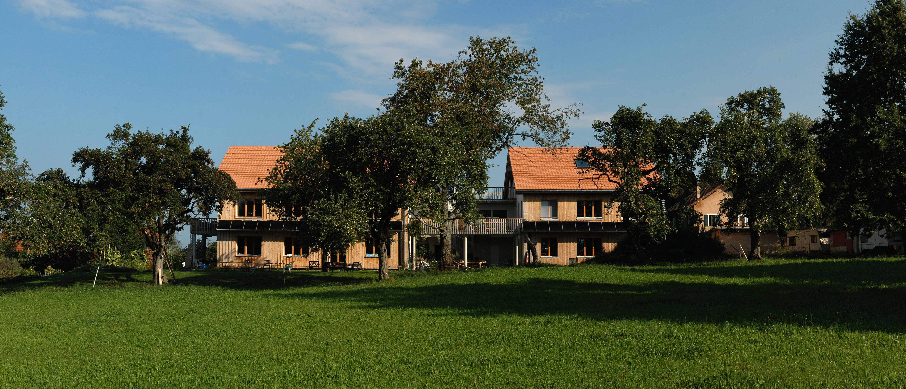

_"Au Milieu d'Ecoteaux"_ est une coopérative d'habitation qui a construit et gère un bâtiment de 6 appartements [ici, à Ecoteaux](https://www.geo.vd.ch/?parcelle=CH469283458501).

Notre but est de proposer des appartements simples, fonctionnels et bon marché, en autogestion par ses coopérateurs/habitants.

 
# Invitation: La coopérative fête ses 10 ans

10 ans déjà que la coopérative a été construite !  
Nous invitons tout le village et nos proches à venir fêter ça les 17 et 18 juin prochain.  
Nous espérons que vous pourrez passer :)

